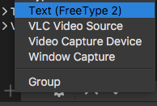
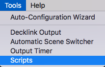
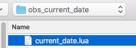
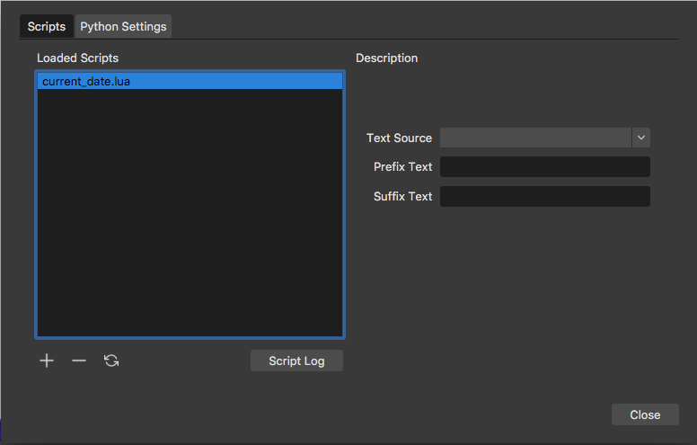
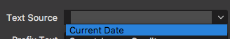

# OBS - Current Date Plugin
OBS Plugin - Current date in YYYY-MM-DD is returned whenever the plugin/source is activated. Prefix/Suffix text is optionally added

Examples:
```
Default: 2019-10-12
With Prefix: Current Date: 2019-10-12
With Suffix: 2019-10-12 is the current date
With Prefix & Suffix: Current Date: 2019-10-12 is the current date
```

## Plugin Installation Instructions

- Open OBS

- Create a new Source with the type being `Text (FreeType 2)`, name it whatever you wish (e.g. Current Date)




- Tools -> Scripts menu



- Load this script via the `+` sign and import the script





- Once loaded, target the `Text Source` to equal the title of the source (e.g Current Date)




- Any updates to `Prefix Text` or `Suffix Text` should be reloaded by turning the source off and then on again for the changes to take effect

